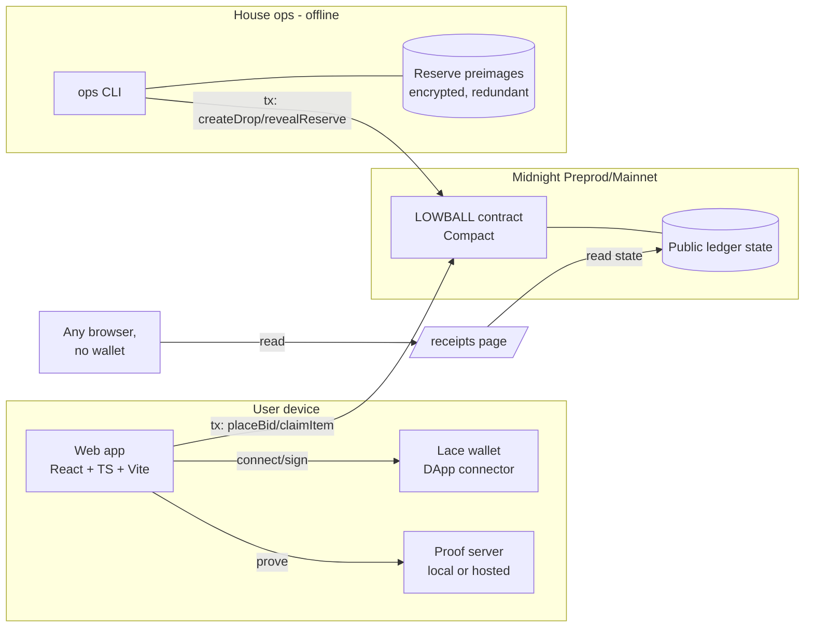
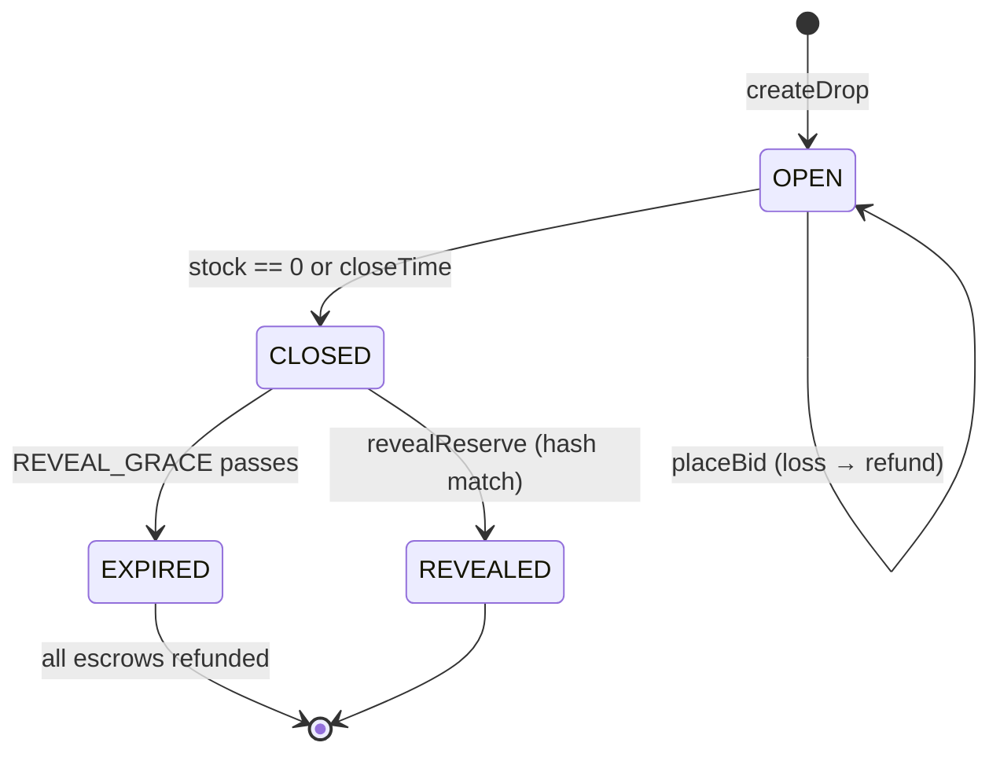
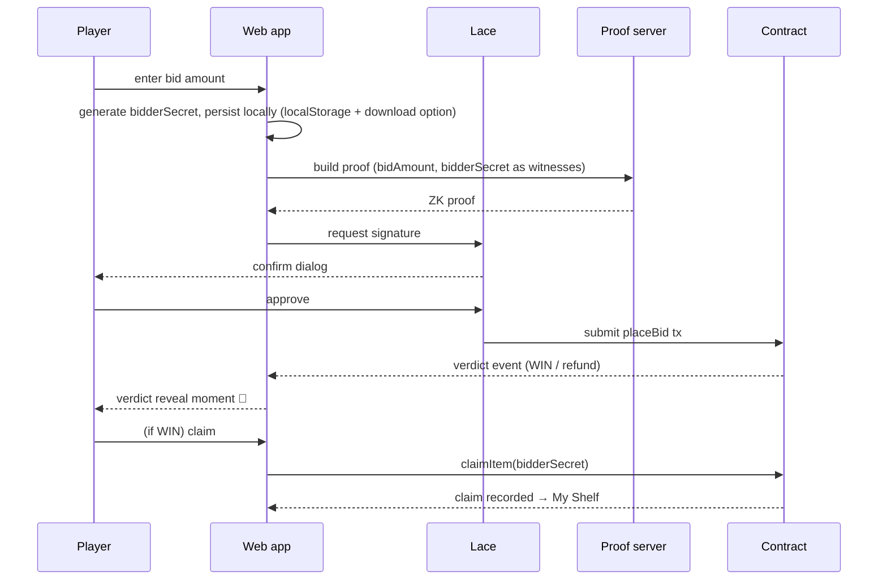

# LOWBALL — Detailed Architecture

**Companion to:** `2026-07-19-lowball-design.md` (the spec). Spec wins on *what*; this doc details *how*.
**Target location in repo:** `docs/architecture.md`

> Compact/Midnight.js API names below are architecture-level pseudocode. Exact syntax, stdlib names, and shielded-transfer capabilities are pinned during the L1 spike (`docs/spikes/escrow-feasibility.md`). Do not treat signatures here as compilable.

## 1. System overview



Principles: **no backend server** (chain is the backend, web is static), **house keys never touch the web app**, **every trust claim has a public verification path**.

## 2. Components: purpose, interface, dependencies

| Unit | One purpose | Consumed via | Depends on |
|---|---|---|---|
| `contract/` | Enforce drop rules: commitment integrity, sealed-bid verdicts, stock, claims, reveals | Circuit calls (Midnight.js) | Compact stdlib, Midnight runtime |
| `web/` | Player experience: browse → bid → verdict → claim; public receipts | Browser | contract API surface, Midnight.js, Lace connector, proof server |
| `ops/` | House actions: create drops, keep preimages safe, close & reveal | CLI commands | contract API surface, local vault file |

Each unit is understandable without reading the others' internals; the shared surface is only the contract's circuit signatures + ledger types (exported as a generated TS package `contract/dist/managed` consumed by both `web/` and `ops/`).

## 3. Contract architecture (`contract/`)

### 3.1 State model

**Public ledger state** (visible to everyone):

```
drops: Map<DropId, {
  commitment: Bytes32        // hash(reserve || salt), set at creation, immutable
  stock: Uint                // remaining units
  closeTime: Uint            // after this: no bids; reveal allowed; expiry refunds allowed
  metaRef: Bytes             // item metadata pointer (name, image URI)
  bidCount: Uint             // total bids ever placed (marketing + audit)
  revealedReserve: Option<Uint>  // None until revealReserve succeeds
  status: OPEN | CLOSED | REVEALED | EXPIRED
}>
claims: Map<ClaimId, { dropId: DropId, owner: PublicAddress }>  // won items ("the shelf")
admin: PublicAddress         // house key, set at deploy
```

**Private state / witnesses** (never on ledger):

```
bidAmount: Uint              // the sealed bid
bidderSecret: Bytes32        // user-held secret binding bidder to their bid/claim
reserve, salt                // house-side only, in ops vault until reveal
```

### 3.2 Commitment scheme

`commitment = H(reserve || salt || dropId)` — domain-separated per drop (`dropId` inside the hash prevents commitment reuse across drops). `H` = whatever commitment hash Compact stdlib provides (pin in spike). Salt is 32 random bytes; reserve is an integer in tDUST minor units.

### 3.3 Circuits

```
createDrop(commitment, stock, closeTime, metaRef)
  guard: caller == admin; stock > 0; closeTime > now
  effect: insert drop with status OPEN

placeBid(dropId) with witnesses (bidAmount, bidderSecret)
  guard: drop.status == OPEN; now < closeTime; stock > 0
  in-circuit: verdict = (bidAmount >= committed reserve)
      // proven against `commitment` without revealing either value:
      // house pre-proves a per-drop relation OR circuit uses the commitment
      // directly — exact technique pinned in spike; candidate approaches:
      //   (a) range-proof against committed value
      //   (b) house-signed encrypted reserve decrypted inside circuit
  on WIN:  stock -= 1; mint claim right bound to H(bidderSecret); escrow kept
  on LOSS: refund escrow; NOTHING disclosed (not even that verdict was a loss
           beyond what refund timing implies — see §7.3)

claimItem(dropId) with witness (bidderSecret)
  guard: caller proves knowledge of bidderSecret matching a claim right
  effect: disclose ownership → claims record (deliberate disclosure #1)

revealReserve(dropId, reserve, salt)
  guard: caller == admin; now >= closeTime or stock == 0
  assert: H(reserve || salt || dropId) == commitment  // tamper check
  effect: revealedReserve = reserve; status = REVEALED (deliberate disclosure #2)

expireDrop(dropId)   // permissionless safety valve
  guard: now >= closeTime + REVEAL_GRACE and status != REVEALED
  effect: status = EXPIRED; all escrows refundable → house cannot strand users
```

### 3.4 Funds paths

**Primary (spike-confirmed):** shielded tDUST escrow inside `placeBid`; kept on win, auto-returned on loss.
**Fallback:** no escrow at bid time — `placeBid` records the sealed commitment only; winner pays `bidAmount` during `claimItem` (amount still shielded); unpaid claims expire after `CLAIM_GRACE`, returning stock. Both paths keep the privacy table in spec §4 intact.

### 3.5 Drop lifecycle



## 4. Bid sequence (happy path)



Failure branches at every arrow are enumerated in §6.2.

## 5. Web app architecture (`web/`)

### 5.1 Structure

```
web/src/
  app/            routes: / (gallery), /drop/:id, /shelf, /receipts/:id, /start (onboarding)
  features/
    wallet/       Lace connect state machine (disconnected→connecting→connected→wrong-network)
    bidding/      bid form, proof progress, verdict reveal, bidderSecret custody
    drops/        ledger reads, drop cards, countdowns
    receipts/     commitment→reveal verification, no-wallet read path
    feedback/     1-question post-verdict widget (L5)
  lib/
    midnight/     THE ONLY module importing Midnight.js — SDK boundary; everything
                  else consumes typed hooks (useDrops, usePlaceBid, useClaim)
    persistence/  pending-tx journal + bidderSecret store (survives reload)
  ui/             design system: envelope ritual, verdict animation, flex card renderer
```

Rules: SDK imports confined to `lib/midnight/` (swap/upgrade SDK without touching features); all chain reads through one query layer with polling; no global state library — React context + reducers per feature (YAGNI).

### 5.2 Client-side resilience

| Failure | Handling |
|---|---|
| Proof server down | Detect before bid UI enables; banner + retry; never lose typed bid |
| Lace absent | `/start` guided install; bid page degrades to read-only + CTA |
| Tx timeout | Pending journal in `persistence/`; on reload, resume watching tx |
| Drop closes mid-flow | Pre-submit re-check + graceful refund message on race loss |
| bidderSecret loss | Secret persisted + "download backup" nudge on first win; claims bound to secret, warn loudly |

### 5.3 Receipts page (`/receipts/:dropId`)

Wallet-free. Reads ledger directly: shows commitment (with block/time observed), bid count, claims, revealed reserve, and re-computes `H(reserve||salt||dropId) == commitment` client-side with a big green/red verdict. This page is the trust product; it must work in a plain browser and be screenshot-clean.

## 6. Ops CLI (`ops/`)

```
lowball create-drop --meta item.json --stock 3 --reserve 15 --close +72h
   → generates salt, computes commitment, writes {dropId, reserve, salt} to vault
     (age/GPG-encrypted file, plus prompted second copy), submits createDrop
lowball close-and-reveal --drop <id>
   → reads vault, submits revealReserve, prints receipts URL + thread template
lowball status
   → all drops, stock, bid counts, pending reveals (nags if REVEAL_GRACE近)
lowball calendar --plan drops.yaml        (L5) schedule 2-3 drops/week
```

Vault loss ≠ user harm: `expireDrop` refunds everyone permissionlessly (§3.3). Vault loss = house embarrassment only.

## 7. Trust & threat model

| Actor | Attack | Defense |
|---|---|---|
| House | Raise reserve after seeing bids | Commitment precedes bids, immutable, hash-checked at reveal |
| House | Selectively reject high bids | House never sees bids; verdicts are in-circuit, not house decisions |
| House | Never reveal (hide that reserve was absurd) | `REVEAL_GRACE` → EXPIRED → permissionless refunds; receipts page shows shame state |
| Player | Claim someone else's win | Claim right bound to `H(bidderSecret)`; proof of knowledge required |
| Player | Bid, win, refuse to pay (fallback path) | `CLAIM_GRACE` expiry returns stock |
| Observer | Learn bid amounts from chain | Amounts are witnesses; escrow shielded; nothing on ledger |
| Observer | Correlate refund timing → infer "close" bids | **Accepted leak, documented:** verdict timing is uniform (instant) regardless of margin, so timing reveals only win/loss, which stock changes reveal anyway |

§7.3 note: `bidCount` is deliberately public (marketing + audit); it leaks participation volume, not participants.

## 8. Environments & delivery

| | Preprod (L1–L5) | Mainnet (L6) |
|---|---|---|
| Contract | deployed per level, address in README | one audited-by-checklist deploy |
| Web | Vercel previews per PR, prod = main | same app, env-switched config |
| Config | `config/preprod.ts` / `config/mainnet.ts` — network ids, contract address, faucet links | no faucet, real tDUST |

CI (GitHub Actions, every push): `compact compile` → contract tests → web typecheck/build → badge. CD: Vercel auto from `main`. Deploys to chain are manual CLI acts, never CI (keys stay off CI).

## 9. Pinned-by-spike list (L1)

1. Exact commitment hash primitive + Compact syntax for the reserve comparison technique (§3.3 candidates a/b).
2. Shielded escrow-with-refund feasibility → primary vs fallback funds path (§3.4).
3. Whether verdict can be read same-block by the UI (event/state polling pattern).
4. `now`/block-time semantics for `closeTime` guards.
5. Wallet-address privacy defaults on bid txs (confirm the "which wallet bid" row of the privacy table holds under real chain conditions).
